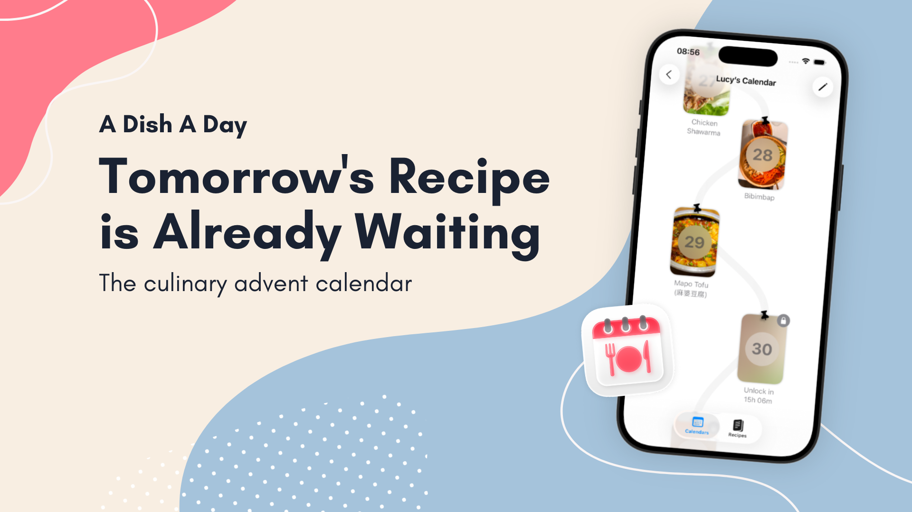

# A Dish A Day

Your family's recipe collection deserves a home. A Dish A Day is an iOS app for preserving and organizing cherished family recipes. From grandma's secret apple pie to mom's Sunday roast.

Plan your meals for the week, digitize handwritten recipe cards, and keep generations of culinary traditions alive in one beautiful app.

## Features

- **Family Recipe Collection** - Store and organize recipes passed down through generations, complete with photos and personal notes
- **Meal Planning** - Schedule recipes on a calendar to plan your week's meals
- **Recipe Scanning** - Snap a photo of grandma's handwritten recipe card and let AI extract the ingredients and steps
- **Reminders** - Get notified when it's time to start cooking
- **Share with Family** - Export recipe calendars to share with loved ones
- **Starter Recipes** - Bundled recipe collections featuring our favorites to get you cooking

## Requirements

- iOS 26.0+
- Xcode 26.0+ (CI builds with Xcode 26.6)
- OpenAI API key (optional, for recipe scanning)

## Development Setup

1. Clone the repository
2. Install tools: `brew install swiftlint typos-cli periphery` (CI pins the SwiftLint and typos versions in `.github/workflows/quality-checks.yml`)
3. Enable git hooks: `git config core.hooksPath scripts/hooks`
4. Install Convex dependencies with [Bun](https://bun.sh): `bun install`
5. Open `ADishADay.xcodeproj` in Xcode (or [Cursor](https://cursor.sh) with [SweetPad](https://sweetpad.hzbd.me))
6. Build and run on simulator or device

### Convex Backend Development

The app uses [Convex](https://convex.dev) for real-time backend features. To develop with the backend:

**Terminal 1 - Convex Dev Server:**
```bash
bunx convex dev
```

**Terminal 2 - Run Xcode:**
```bash
# Build and run normally in Xcode
```

The Convex dev server watches for changes in `convex/` and auto-deploys functions. The iOS app connects to `https://jovial-firefly-799.convex.cloud`.

**Convex Commands:**
- `bunx convex dev` - Start dev server with hot reload
- `bunx convex dashboard` - Open Convex dashboard
- `bunx convex import --table <name> <file.jsonl>` - Import data
- `bunx convex deploy` - Deploy to production

See [AGENTS.md](AGENTS.md) for detailed backend development workflow.

### btca (Better Context)

AI agents use the [btca-local](https://github.com/davis7dotsh/better-context) skill in `.agents/skills/btca-local` to search up-to-date source repositories. `.agents/btca.config.jsonc` lists the resources (Inject, SwiftDate, Convex Swift, and more); each one is cloned into `~/.btca/agent/sandbox/<name>`. No global install is needed.

### Hot Reloading with Inject

This project supports hot reloading via [Inject](https://github.com/krzysztofzablocki/Inject). To enable it:

1. Download [InjectionIII](https://github.com/johnno1962/InjectionIII/releases) and place it in `/Applications`. Use the GitHub release instead of the App Store version.
2. Build and run your app in the simulator

The injection bundle loads automatically. Save any Swift file and changes appear instantly without rebuilding!

#### Inject + Convex Compatibility

The `-Xlinker -interposable` linker flags have been removed to allow ConvexMobile (Rust-based SDK) to load properly. Without these flags:

- Hot reload **works** for class methods (via swizzling)
- Hot reload **does not work** for structs, enums, or free functions (requires interposing)
- SwiftUI views using `@ObserveInjection` still work since they use class-based observation

### Finding Unused Code

Run [Periphery](https://github.com/peripheryapp/periphery) periodically to find dead code:

```bash
periphery scan --project ADishADay.xcodeproj --schemes "A Dish A Day"
```

## License

This project is licensed under the MIT License - see the [LICENSE](LICENSE) file for details.
